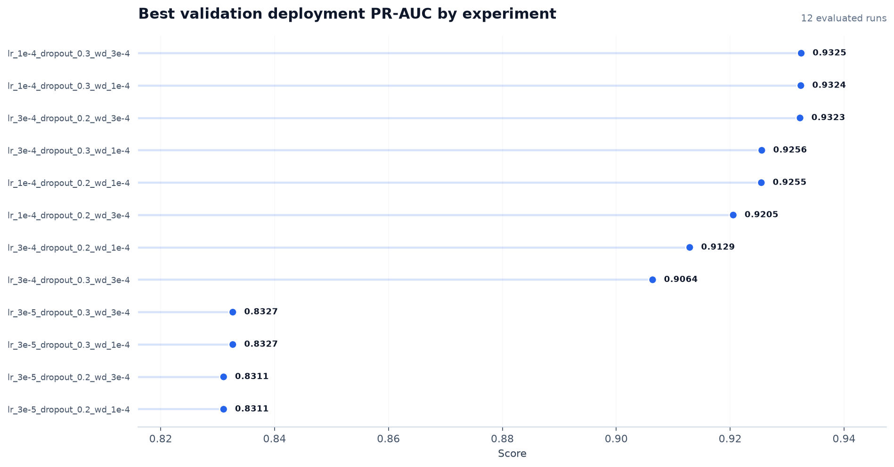
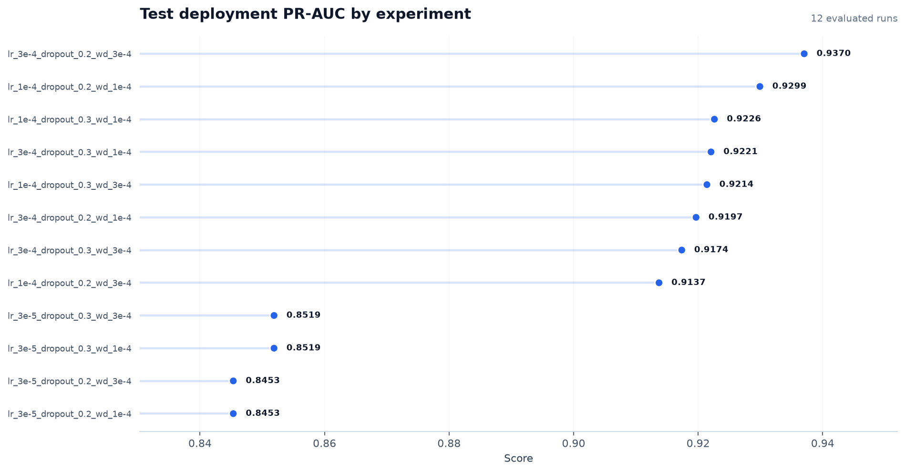
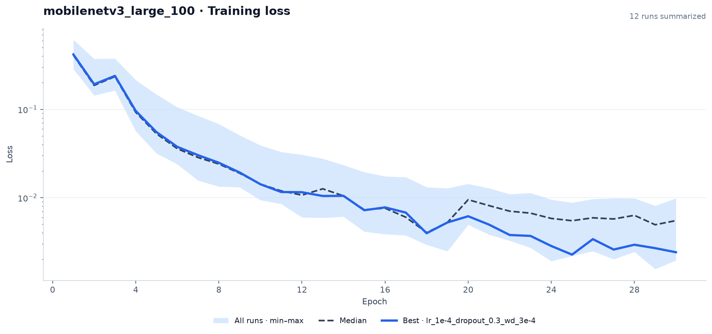
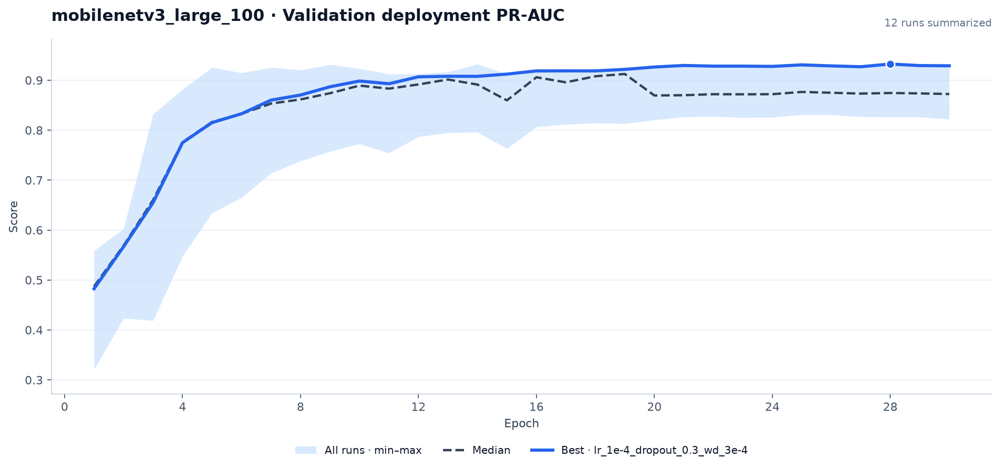
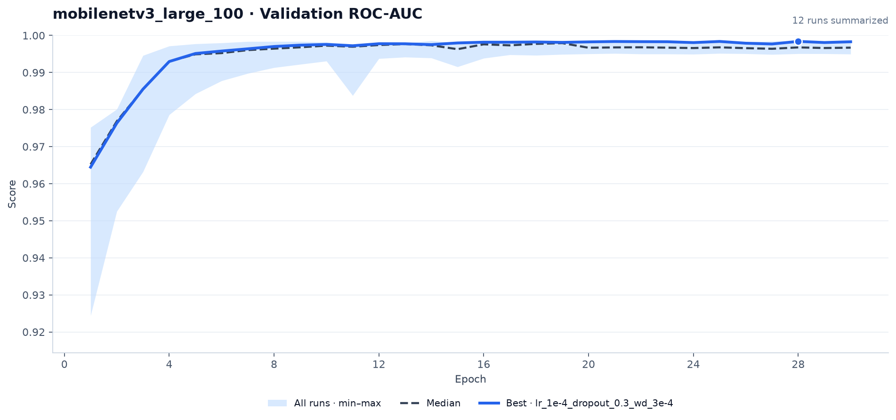
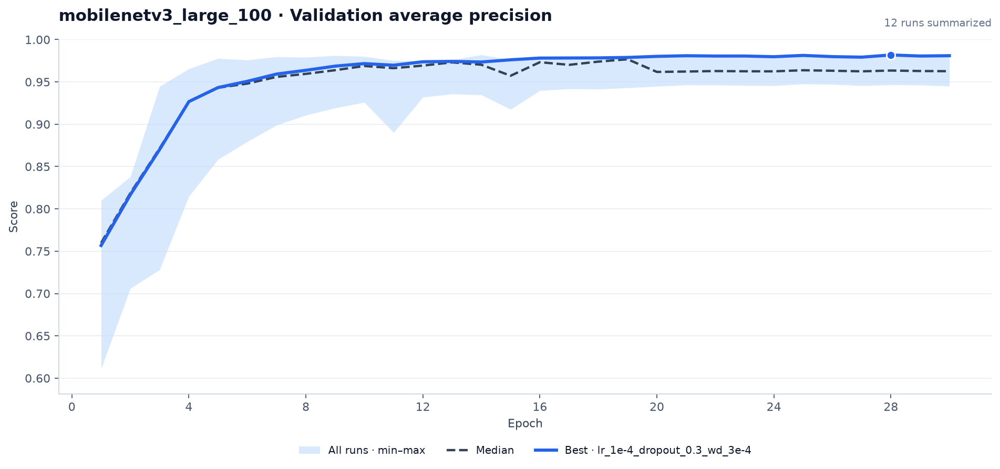

# Training report

This report includes 12 experiment runs across 1 model.

## Experiment comparisons

### Best validation deployment PR-AUC

### Test deployment PR-AUC

## Model details

### mobilenetv3_large_100

| Experiment | Status | Epochs | Best epoch | Best validation PR-AUC | Test PR-AUC | Learning rate | Dropout | Weight decay |
| --- | --- | ---: | ---: | ---: | ---: | ---: | ---: | ---: |
| lr_1e-4_dropout_0.3_wd_3e-4 | Completed | 30 / 30 | 28 | 0.9325 | 0.9214 | 0.000100 | 0.300 | 0.000300 |
| lr_1e-4_dropout_0.3_wd_1e-4 | Completed | 30 / 30 | 28 | 0.9324 | 0.9226 | 0.000100 | 0.300 | 0.000100 |
| lr_3e-4_dropout_0.2_wd_3e-4 | Completed | 19 / 30 | 14 | 0.9323 | 0.9370 | 0.000300 | 0.200 | 0.000300 |
| lr_3e-4_dropout_0.3_wd_1e-4 | Completed | 12 / 30 | 7 | 0.9256 | 0.9221 | 0.000300 | 0.300 | 0.000100 |
| lr_1e-4_dropout_0.2_wd_1e-4 | Completed | 30 / 30 | 25 | 0.9255 | 0.9299 | 0.000100 | 0.200 | 0.000100 |
| lr_1e-4_dropout_0.2_wd_3e-4 | Completed | 30 / 30 | 25 | 0.9205 | 0.9137 | 0.000100 | 0.200 | 0.000300 |
| lr_3e-4_dropout_0.2_wd_1e-4 | Completed | 17 / 30 | 12 | 0.9129 | 0.9197 | 0.000300 | 0.200 | 0.000100 |
| lr_3e-4_dropout_0.3_wd_3e-4 | Completed | 18 / 30 | 13 | 0.9064 | 0.9174 | 0.000300 | 0.300 | 0.000300 |
| lr_3e-5_dropout_0.3_wd_1e-4 | Completed | 30 / 30 | 25 | 0.8327 | 0.8519 | 0.000030 | 0.300 | 0.000100 |
| lr_3e-5_dropout_0.3_wd_3e-4 | Completed | 30 / 30 | 25 | 0.8327 | 0.8519 | 0.000030 | 0.300 | 0.000300 |
| lr_3e-5_dropout_0.2_wd_1e-4 | Completed | 30 / 30 | 25 | 0.8311 | 0.8453 | 0.000030 | 0.200 | 0.000100 |
| lr_3e-5_dropout_0.2_wd_3e-4 | Completed | 30 / 30 | 25 | 0.8311 | 0.8453 | 0.000030 | 0.200 | 0.000300 |

#### Learning curves

The solid blue line is the experiment with the highest validation deployment PR-AUC, the dashed line is the median, and the shaded band is the min–max range across all runs.

##### Training loss

##### Validation deployment PR-AUC

##### Validation ROC-AUC

##### Validation average precision

